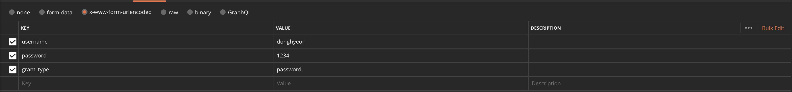

# 열정팩토리 백엔드 코딩과제

## 📖 기술스택 

- JDK 1.8
- H2 DB
- Gradle
- Lombok

## 👍 추가 구현

- Authorization
- Unit Test, Integration Test (단위 테스트는 테스트할 내용이 마땅히 없어서 제외했어요.)
- Dev / Prod Environment
- Image Upload

## ‼ 테스트 하기 전

Get 메소드 제외한 나머지 메소드는 권한이 필요하기 때문에 토큰을 먼저 발급받아야 합니다.

> http://127.0.0.1:8080/oauth/token

username : clientid // password : pwd

그 다음 다음과 같은 파라미터로 호출해주시면 토큰이 발급됩니다.

> 해당 데이터는 스프링 시작되자마자 만들어집니다.

제가 테스트하던 PostMan 자료도 함께 올렸습니다.

Todo_PostMan.json

User_PostMan.json 

감사합니다
